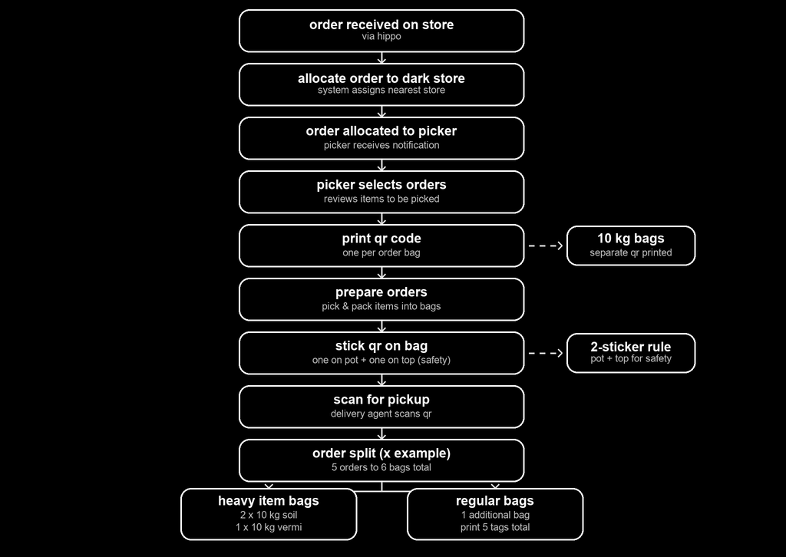

# urvann darkstore flow (for practice)

a simple walkthrough of how an order moves from the dark store to delivery.

## overview

this repo documents the operations flow at a dark store — from the moment an order is
received to when it is split into bags and scanned for pickup. it is meant as a
practice reference for understanding the pick, pack and dispatch process.

## flow

## steps

- **order received on store** — order comes in via hippo.
- **allocate order to dark store** — system assigns the nearest store.
- **order allocated to picker** — picker receives a notification.
- **picker selects orders** — reviews the items to be picked.
- **print qr code** — one qr per order bag (10 kg bags get a separate qr).
- **prepare orders** — pick and pack items into bags.
- **stick qr on bag** — two-sticker rule: one on pot + one on top for safety.
- **scan for pickup** — delivery agent scans the qr.
- **order split (x example)** — 5 orders become 6 bags total.

## bag split example

- **heavy item bags** — 2 × 10 kg soil, 1 × 10 kg vermi.
- **regular bags** — 1 additional bag, print 5 tags total.

## notes

- side notes in the flow cover the 10 kg bag qr and the 2-sticker safety rule.
- this is a practice project, so details are kept short and simple.
